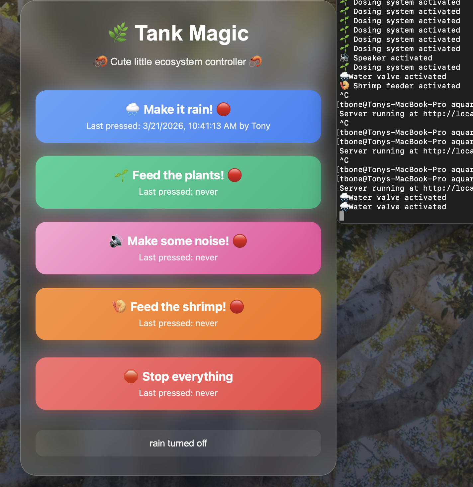

# Tank Magic

A self-hosted aquarium control system with a mobile-friendly web UI, role-based access, activity logging, and secure remote access.

---

## Overview

Tank Magic is a custom control panel for managing an aquarium system from a browser. It was built as both a real control interface and a portfolio/demo project.

Current features include:

- Role-based authentication
- Remote access over Tailscale
- Server-side activity logging
- Server-synced button state across devices
- Rain timer with shared countdown
- Protection against repeated dosing/feeding actions
- Secure authentication with hashed passwords

---

## Authentication System

The application includes a role-based login system with securely hashed passwords.

- Passwords are hashed using bcrypt
- No plain-text credentials are stored
- Role-based access:
  - **Admin**: full control
  - **User**: operational control
  - **Viewer**: read-only/demo mode

---

## Security

- Passwords are stored using bcrypt hashing
- Sessions are managed via express-session
- Role-based access control prevents unauthorized actions
- Designed for use on a private network (e.g., Tailscale)

---

## Control Panel UI

The main control panel supports:

- Rain control
- Plant dosing
- Sound trigger
- Shrimp feeding
- Stop all systems

---

## Activity Logging

The server logs user actions, roles, allowed/blocked attempts, and timestamps for auditing and debugging.

---

## Server-Synced Last Pressed State

The UI reflects server-side state rather than local browser timestamps.

- Consistent across all devices
- Persists after refresh
- Derived from backend state
- Used to warn before repeated dosing or feeding actions

---

## Rain System (Server-Controlled Timer)

Rain cycles are controlled entirely by the server:

- 45-minute runtime managed server-side
- All clients stay synchronized
- Prevents duplicate triggers while active
- Displays live countdown in the UI

---

## Tech Stack

- Node.js
- Express
- HTML / CSS / JavaScript
- Tailscale
- File-based state and activity logging

---

## In Progress

Planned improvements:

- Weekly dosing scheduler
- Better settings page
- Hashed password storage
- Hardware integration on Raspberry Pi
