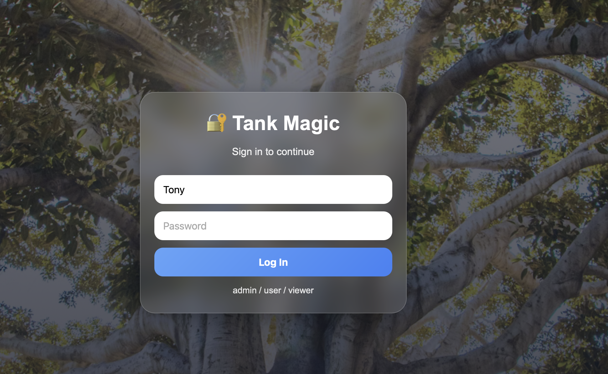
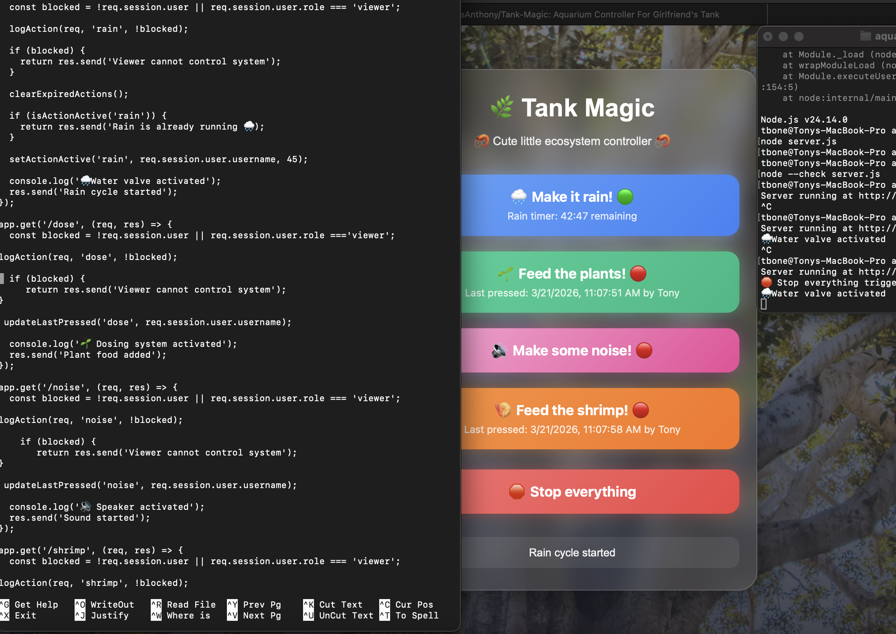
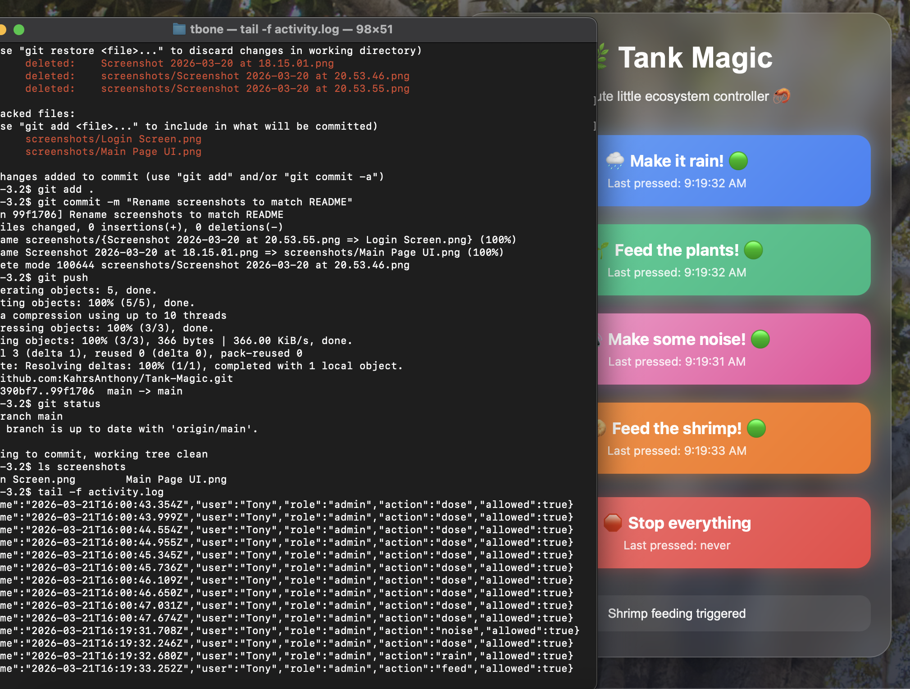
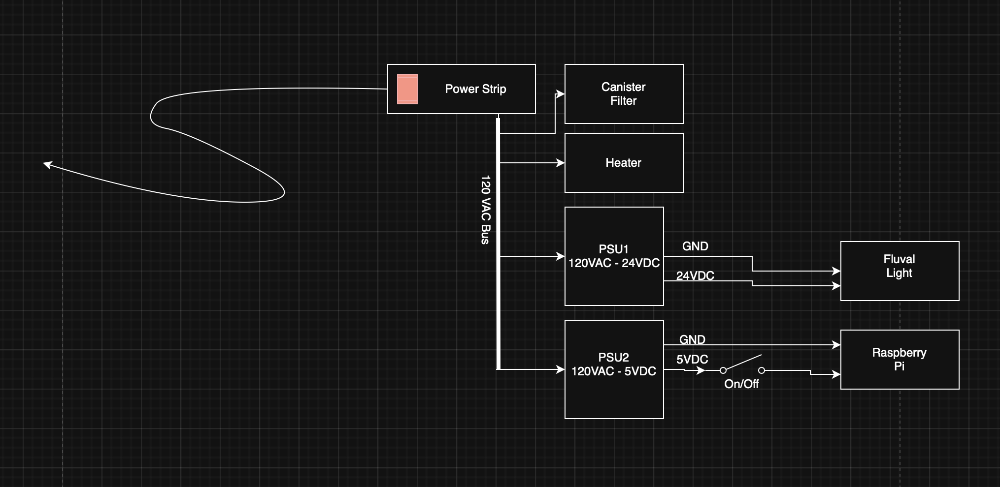
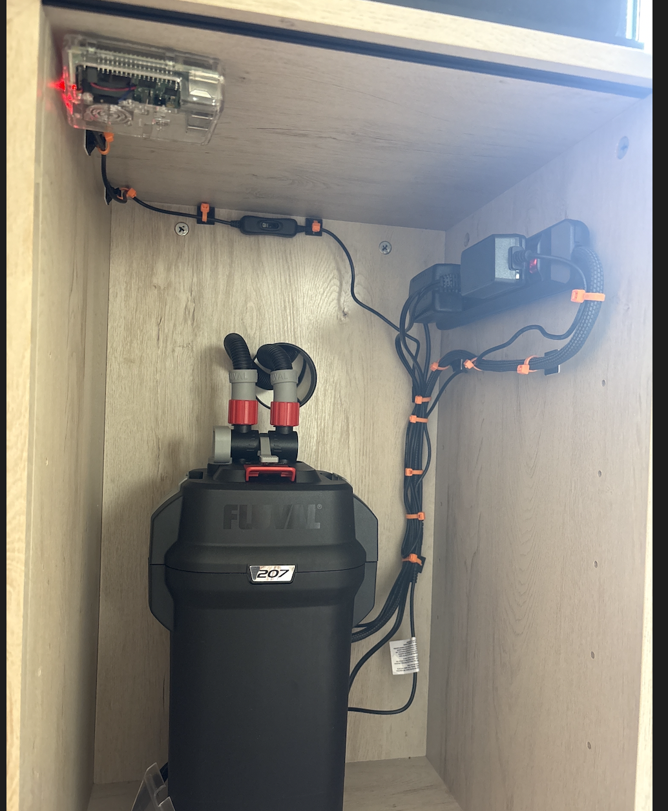
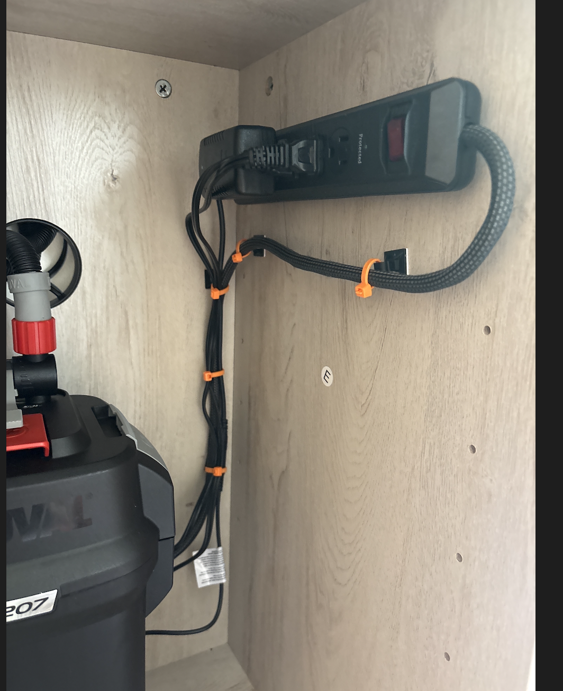
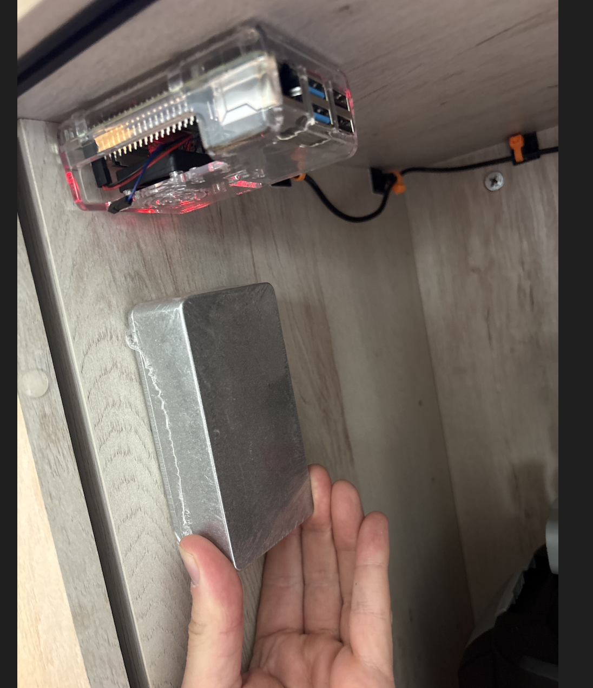

# Tank Magic

Tank Magic is a Raspberry Pi–based aquarium control system being built as a full hardware/software integration project.

It started as a web control panel, but the goal is now much bigger: a cabinet-mounted control system that manages sound, rain effects, dosing, safety logic, and future physical automation from one place.

---

## Project Overview

Tank Magic is being developed as:

- a real aquarium automation system
- a Raspberry Pi cabinet integration project
- a portfolio project showing full-stack development, state synchronization, deployment, and hardware planning

The system already runs on a Raspberry Pi and can be accessed remotely while maintaining shared state across devices.

---

## System Vision

The long-term goal is a complete integrated aquarium cabinet system with these major subsystems:

- **Control System**  
  Raspberry Pi host, server logic, timers, authentication, logging, and remote access

- **Noise System**  
  Thunder and rain audio playback through a mounted speaker and amplifier

- **Rain System**  
  Motor valve and plumbing path for controlled overhead rain deployment

- **Dosing System**  
  Multi-bottle weekday recipe dosing with future scheduling support

- **Safety / Reset System**  
  Global stop/reset behavior for active effects and future hardware outputs

---

## Current Software Progress

The current software platform already includes:

- role-based authentication
- password hashing with bcrypt
- server-side session storage
- shared state across devices
- rain timer
- noise timer
- stop/reset behavior
- activity logging
- Raspberry Pi deployment with systemd
- Tailscale remote access

### Login System

### Main Control Panel

### Rain Timer

### Activity Log

---

## Current System Overview

Tank Magic is currently layered on top of an existing aquarium setup.

At this stage:
- life-support systems (filter, heater) remain independently powered
- Tank Magic handles control logic, UI, and new subsystem integration
- hardware control is being added incrementally and safely

---

## Current Power Distribution

The aquarium is currently powered through a central power strip, with dedicated supplies for lighting and control electronics.

### Notes

- Canister filter and heater remain always powered
- Fluval light is powered via a dedicated 24V supply
- Raspberry Pi is powered via a dedicated 5V supply with manual switch
- Tank Magic does not yet interrupt critical life-support systems

This layout serves as the baseline for future integration.

## Current Hardware Progress

Tank Magic is now physically deployed inside the aquarium cabinet.

The current hardware build is focused on:
- safe placement of electronics
- cable routing
- future expansion room
- keeping control hardware high and away from water exposure

### Hardware Overview

#### Raspberry Pi Mounting

#### Power Cable Routing

#### Potential Relay Mount Location

### Current Cabinet Notes

- Raspberry Pi is mounted inside the cabinet
- power strip is mounted and routed cleanly
- electronics are positioned high and away from likely water exposure
- cabinet space is being reserved for relay and control hardware
- the current layout is being built toward full system integration, not just standalone software

---

## Subsystem Roadmap

### Noise System
Planned as the first physical subsystem.

Goal:
- thunder and rain sounds
- timed deployment
- mounted speaker inside cabinet
- always-ready system, not Bluetooth-dependent

### Rain Water System
Planned as a dedicated physical effect system using:

- motor valve
- plumbing path
- timed deployment
- future pairing with sound for storm effects

### Dosing System
Planned as an **8-bottle dosing system** supporting:

- weekday recipes
- scheduled dosing
- recipe-based automation
- future expansion and refinement

---

## To-Do

- [ X ] Build the noise system for thunder and rain sounds (IMPLEMENTED)
- [ X ] Add a timer for automatic deployment of the rain sound system
- [ ] Install and wire a mounted speaker
- [ ] Build the motor valve and plumbing for the rain water system
- [ ] Design and implement an 8-bottle dosing system with weekday recipes
- [ ] Add atomizer to create fog effect
- [ ] Add white led strip to simulate lighting strikes
- [ ] Add sudo random weather effect selection system that deploys weather events randomly throughout the day
---

## Deployment

Tank Magic is currently deployed on a Raspberry Pi and runs as a persistent service.

Current deployment features:
- Raspberry Pi host
- systemd-managed server
- file-based session storage
- remote access through Tailscale
- shared server-side state across clients

---

## Tech Stack

- Raspberry Pi
- Node.js
- Express
- HTML / CSS / JavaScript
- bcrypt
- session-file-store
- systemd
- Tailscale

---

## About

Tank Magic is no longer just a web application.

It is being developed into a full aquarium cabinet integration system that combines:

- software control
- physical hardware planning
- cabinet-mounted electronics
- future sound, plumbing, and dosing systems
- real-world automation concepts
