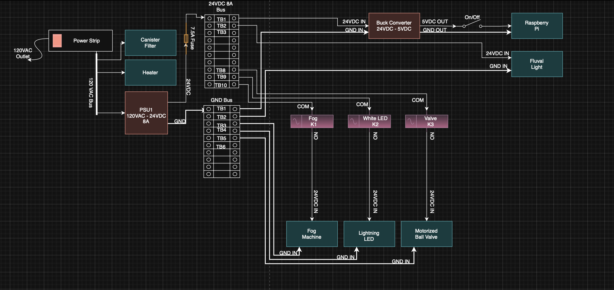
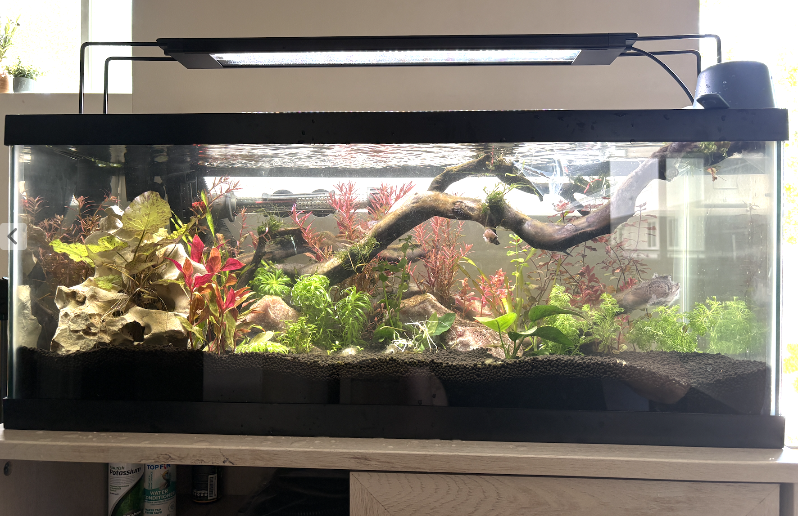
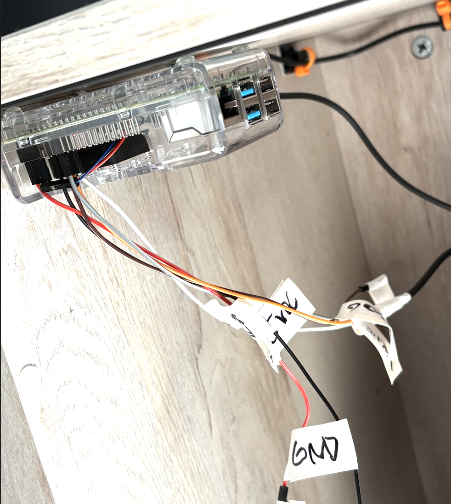
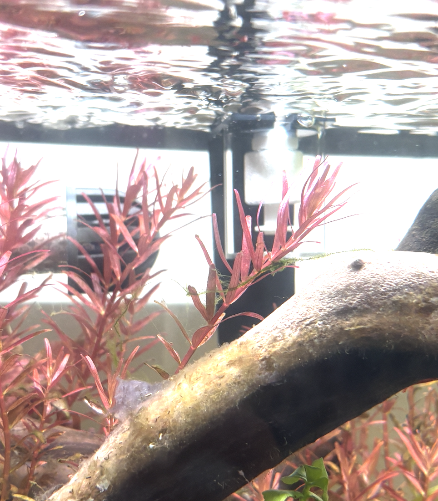

# Tank Magic

Tank Magic is a Raspberry Pi–based aquarium control system being built as a full hardware/software integration project.

It started as a web control panel, but the goal is now much bigger: a cabinet-mounted control system that manages sound, rain effects, dosing, safety logic, and future physical automation from one place.

---

## Project Overview

Tank Magic is being developed as:

- a real aquarium automation system
- a Raspberry Pi cabinet integration project
- a portfolio project showing full-stack development, state synchronization, deployment, and hardware planning

The system already runs on a Raspberry Pi and can be accessed remotely while maintaining shared state across devices.

---

## System Vision

The long-term goal is a complete integrated aquarium cabinet system with these major subsystems:

- **Control System**  
  Raspberry Pi host, server logic, timers, authentication, logging, and remote access

- **Noise System**  
  Thunder and rain audio playback through a mounted speaker and amplifier

- **Rain System**  
  Motor valve and plumbing path for controlled overhead rain deployment

- **Dosing System**  
  Multi-bottle weekday recipe dosing with future scheduling support

- **Safety / Reset System**  
  Global stop/reset behavior for active effects and future hardware outputs

---

## Current Software Progress

The current software platform already includes:

- role-based authentication
- password hashing with bcrypt
- server-side session storage
- shared state across devices
- activity logging
- emergency stop / reset behavior
- Raspberry Pi deployment with systemd
- Tailscale remote access
- weather effect state management
- drizzle effect logic
- rain effect logic (currently simulated in software)
- storm mode composition (drizzle + rain + thunder)
- scheduled daily storm trigger

### Login System

### Main Control Panel

### Rain Timer

### Activity Log

---

## Current System Overview

Tank Magic is currently layered on top of an existing aquarium setup.

At this stage:
- life-support systems (filter, heater) remain independently powered
- Tank Magic handles control logic, UI, and new subsystem integration
- hardware control is being added incrementally and safely

---

## Current Power Distribution

The aquarium is currently powered through a central power strip, with dedicated supplies for lighting and control electronics.

### Power Distribution (REV1)

### Notes

- Canister filter and heater remain always powered
- Fluval light is powered via a dedicated 24V supply
- Raspberry Pi is powered via a dedicated 5V supply with manual switch
- Tank Magic does not yet interrupt critical life-support systems

This layout serves as the baseline for future integration.

---

## Latest Hardware Progress (March 2026)

Tank Magic has officially transitioned from a software-only project into a live hardware-integrated system.

### GPIO + Hardware Control
- Migrated from `onoff` (sysfs) to `pinctrl` due to kernel compatibility issues
- Confirmed stable GPIO control on Raspberry Pi
- Fog relay and rain relay pins are now controlled through backend logic

### Water Level Sensor (Float Switch)
- Float switch installed and wired to **GPIO 22**
- Configured with internal pull-up (`pinctrl set 22 ip pu`)
- Verified real-time switching between HIGH and LOW states
- Backend logic correctly interprets:
  - `LOW` → water level low (`waterLow = true`)
  - `HIGH` → water level safe (`waterLow = false`)

### Backend Integration
- Added `/api/status` endpoint returning:
  - `waterLow`
  - `fogActive`
  - `rainActive`
  - `noiseActive`
- First complete loop achieved:
  > Physical sensor → GPIO → backend → API → UI-ready data

### System Milestone
This marks the first fully functional hardware feedback system in Tank Magic.

---

## Build Photos

### Tank Full Update

### Float Switch Wiring (GPIO)

### Float Switch Installed in Tank

### Float Switch Mounted at Top

---

## Dev Log

### 2026-03-29
- Replaced broken GPIO system (`onoff`) with `pinctrl`
- Brought real GPIO control online
- Installed and validated float switch sensor
- Confirmed live water-level readings via API
- Established first hardware → backend integration loop

### Hardware Overview

#### Raspberry Pi Mounting

#### Power Cable Routing

#### Potential Relay Mount Location

### Current Cabinet Notes

- Raspberry Pi is mounted inside the cabinet
- power strip is mounted and routed cleanly
- electronics are positioned high and away from likely water exposure
- cabinet space is being reserved for relay and control hardware
- the current layout is being built toward full system integration, not just standalone software

---

## Subsystem Roadmap

### Noise System
Planned as the first physical subsystem.

Goal:
- thunder and rain sounds
- timed deployment
- mounted speaker inside cabinet
- always-ready system, not Bluetooth-dependent

### Rain Water System
Planned as a dedicated physical effect system using:

- motor valve
- plumbing path
- timed deployment
- future pairing with sound for storm effects

### Dosing System
Planned as an **8-bottle dosing system** supporting:

- weekday recipes
- scheduled dosing
- recipe-based automation
- future expansion and refinement

### Weather Engine

Current backend weather logic now supports:
- drizzle effect state
- rain effect state
- composed storm mode
- scheduled event triggering

Future weather engine goals:
- phased storm sequencing
- random weather event generation
- configurable scene profiles
- lightning / flash integration
- fade-out transitions

---

## To-Do

## To-Do
- [x] Build the noise system for thunder and rain sounds
- [x] Add scheduled storm event triggering for backend testing
- [x] Build software support for drizzle, rain, and storm world states
- [ ] Install and permanently wire the mounted speaker
- [ ] Install relay hardware for fog / rain control
- [ ] Build the motor valve and plumbing for the rain water system
- [ ] Add atomizer to create fog effect
- [ ] Add white LED strip to simulate lightning strikes
- [ ] Refactor storm mode into phased sequencing (drizzle -> rain -> full storm -> fadeout)
- [ ] Add random weather event selection system with day/time scheduling
- [ ] Design and implement an 8-bottle dosing system with weekday recipes
- [ ] Improve cabinet cable management

---

## Deployment

Tank Magic is currently deployed on a Raspberry Pi and runs as a persistent service.

Current deployment features:
- Raspberry Pi host
- systemd-managed server
- file-based session storage
- remote access through Tailscale
- shared server-side state across clients

---

## Tech Stack

- Raspberry Pi
- Node.js
- Express
- HTML / CSS / JavaScript
- bcrypt
- session-file-store
- systemd
- Tailscale

---

## About

Tank Magic is no longer just a web application.

It is being developed into a full aquarium cabinet integration system that combines:

- software control
- physical hardware planning
- cabinet-mounted electronics
- future sound, plumbing, and dosing systems
- real-world automation concepts

---

## Recent Progress

Recent backend progress focused on cleaning and restructuring the control logic before additional hardware is connected.

Completed:
- separated hardware control functions from world-state logic
- added drizzle and rain effect helpers
- added basic storm mode composition
- added scheduled storm mode trigger for daily testing
- improved fallback behavior when GPIO hardware is not yet fully installed

Current status:
- thunder audio is physically working
- rain and fog are currently simulated in software until relays and plumbing are installed

---

## Parts List

Things I've bought so far:

- Raspberry Pi 4
- Fluval 207 Canister Filter
- Fluval Plant 4.0 light
- Marineland 30W Heater
- 20 Gallon Long Tank
- Aquarium Stand
- Power strip w/ Usb ports
- Raspberry Pi 4 fan case
- "Sound Blaster" Speaker bar
- USBC Pi Power Cable
- 64G SD Card
- Small Mounting Screws
- ZipTie mounts
- Orange Zip Ties
- Wire Loom

Shopping List:

- Buck Power Converter 24VDC-5VDC
- 2 Bus Terminals x10
- 24VDC 8A Power Supply
- 18-22AWG Wire
- Terminal wire ends
- solder iron/solder
- 4 channel relay board
- 7.5A fuse
- In-line Fuse holder
- Fog Machine
- Motorized ball valve
- White Led Strip
- Black Electrical Tape
- More wire loom
- Better Cable management solution
